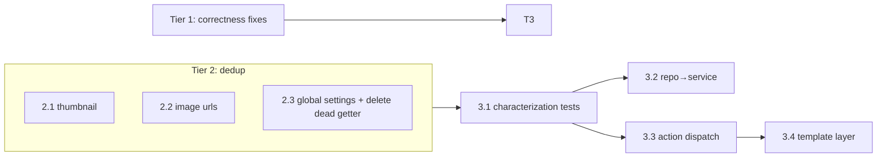

# Refactor Plan

Ordered by leverage-to-risk: cheap correctness fixes and de-duplication first (they
also shrink the surface before the structural work), then the controller decomposition
last because it is the biggest change and needs test cover before it starts.

## Tier 1 — Correctness fixes (low risk, do first)

Behavior bugs, not cleanups. Each is small and independently shippable.

### 1.1 — Upload-token `used_at` never set

`src/includes/Repository/class-upload-token-repository.php`. The `used_at IS NULL`
filter (`:145`) is dead — nothing ever writes a timestamp. Decide the intended
semantics first: is a token single-use, or per-member-quota-limited (reusable until
quota hit)? The code today implements the latter by accident.

- If single-use: write `used_at` when the upload succeeds (in `Upload_Handler`, not the
  repository).
- If quota-based: delete the `used_at` column and its filter — it is misleading dead
  schema.

Risk: low. Blast radius: the upload flow only. Ship as its own PR so the semantics
decision is reviewable.

### 1.2 — Dead/broken `Results_Controller::get_global_settings()`

`src/admin/class-results-controller.php:1019-1023` reads `photo_comp_global_settings`,
which is never written. It is wired to nothing today. Fold into 2.3 below (delete it as
part of consolidating the getter). Zero-risk — confirmed dead, no call sites.

### 1.3 — `send_results_email()` bypasses the template system

`src/includes/Service/class-email-service.php:285-311` hardcodes subject/body; it is the
actively-used path (`class-results-controller.php:1102`,
`class-email-results-job-manager.php:338`). Route it through
`get_template()`/`replace_merge_tags()`/`wrap_html_email()` like the newer
notifications, and add a "results" template to the admin editor's registry. Risk: medium
— it changes email output. Needs a before/after render test.

### 1.4 (optional) — Rate-limit password voting

`src/public/class-voting-shortcode.php:502`. Low stakes by design (shared in-room
password). Add a transient-based attempt counter keyed on IP+competition, or explicitly
document it as out of scope. Lowest priority — do not block the refactor on it.

## Tier 2 — De-duplication (low risk, unblocks Tier 3)

Pure extraction, behavior-preserving. Do these before the structural work — they remove
noise from the files about to be carved up.

### 2.1 — `get_thumbnail_filename()` ×4 → `Image_Processor`

Byte-identical in `class-submissions-controller.php:1000`,
`class-results-controller.php:1006`, `class-top3-shortcode.php:371`,
`class-results-shortcode.php:371`. `Image_Processor` (`:470-500`) already owns URL
derivation — this belongs beside it. Replace all four call sites.

### 2.2 — `get_image_urls()` ×2 → shared

Verbatim copy between `class-top3-shortcode.php:327` and
`class-results-shortcode.php:327`. Extract to a shared base or `Image_Processor`. These
two shortcodes are near-clones generally — check whether one base class collapses more
than this method.

### 2.3 — `get_global_settings()` ×5 → one static on `Competition_Settings`

`class-voting-controller.php:737`, `class-members-controller.php:1087`,
`class-settings-controller.php:561`, `class-competitions-controller.php:1361`, plus the
broken one (1.2). Add `Competition_Settings::global_settings()` reading
`photo_comp_default_settings` through `parse()`; replace all five. This closes 1.2 too.

## Tier 3 — Structural (high leverage, higher risk — gate behind tests)

The controllers are the real liability, but they have almost no test cover, so
decomposing blind is dangerous.

### 3.1 — Characterization tests first

Before touching structure, add tests that pin current behavior of the voting workflow
and the action handlers — especially `Voting_Controller` (the step-machine in
`render_workflow_steps`, `:936-1180`) and each `handle_actions()` action branch. These
are the safety net for 3.2–3.4. This is the actual prerequisite, not optional.

### 3.2 — Move orchestration out of repositories

`Upload_Token_Repository::send_upload_link_for_member()` (`:291-358`) and
`Competitions_Repository::send_submission_reminder_emails()` (`:529-631`) send email and
rate-limit. Move to a `Service` class (the pattern already exists in `Upload_Handler`).
Repositories return data; services compose. Medium risk — touches the reminder/magic-link
flows.

### 3.3 — Extract an action dispatcher from `handle_actions()`

Each controller's `handle_actions()` is a 300–570-line `if ('x' === $action)` chain
repeating the same sanitize → `check_admin_referer` → find-or-404 → mutate →
`redirect_with_settings_errors` boilerplate. Introduce a small dispatch abstraction (an
action map, or per-action handler objects) that factors the boilerplate once. Start with
one controller (`Voting_Controller`) as the pattern, then apply to the other four. High
leverage; do it incrementally, one controller per PR.

### 3.4 — Introduce a template layer for `render_*`

The `render_*` methods `echo` raw HTML inline, mixing markup with business rules. Move
markup into `src/templates/` partials (the directory exists per AGENTS.md), passing
prepared view data. Do this per controller, after 3.3, so each PR shrinks one god-object
along both axes (routing + rendering) at once.

## Dependencies

## Sequencing rule

Tier 1 and Tier 2 are each independent, small PRs — land them in any order. Nothing in
Tier 3 starts before 3.1. Then 3.3→3.4 proceed one controller at a time so each PR is
reviewable and revertable, rather than a single 5,000-line rewrite.
