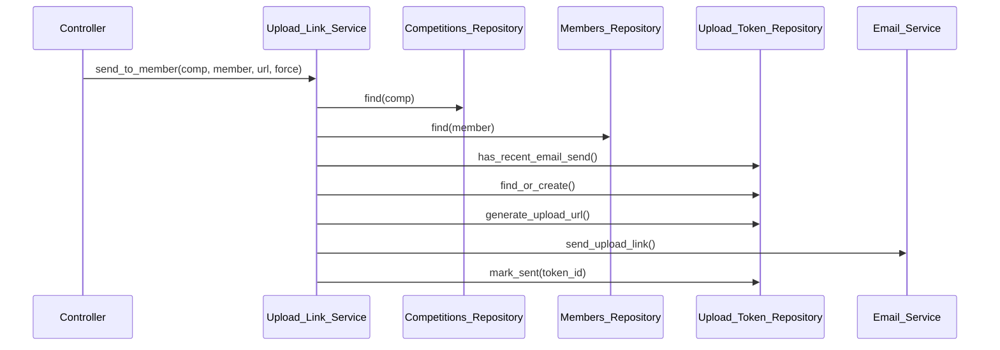

# Design: Move email/orchestration out of repositories into a service (#8)

Date: 2026-07-02
Issue: #8 (Tier 3.2 of `docs/plans/refactor.md`)

## Problem

Two repositories perform service-level orchestration instead of pure persistence:

- `Upload_Token_Repository::send_upload_link_for_member()` — validates competition/member,
  rate-limits, creates a token, generates a URL, sends email via `Email_Service`, and writes `sent_at`.
- `Upload_Token_Repository::send_upload_link_by_email()` — enumeration-safe wrapper over the above.
- `Competitions_Repository::send_submission_reminder_emails()` — bulk campaign: fetches all members,
  resolves the upload page URL, loops the single-send, and tallies a summary.

Repositories should return data; services should compose. The service pattern already exists in
`Upload_Handler`.

## AC premise correction

The issue lists "Blocked by #7 (characterization tests must land first)" and "Characterization/regression
tests green". In fact the three methods being moved have **no** characterization coverage. The only
related test is for `has_recent_email_send()` — a persistence primitive that **stays** in the repo.
So there is no existing green suite to keep; a pin-first step is required (see Testing).

## Design

### New class

`PhotoCompetitionManager\Service\Upload_Link_Service` in
`src/includes/Service/class-upload-link-service.php`. Follows the `Upload_Handler` pattern:
constructor with nullable DI params defaulting to `new`.

```php
public function __construct(
    ?Upload_Token_Repository $token_repo = null,
    ?Competitions_Repository  $competitions_repo = null,
    ?Members_Repository       $members_repo = null,
    ?Email_Service            $email_service = null
)
```

One service (not two): the bulk reminder is a loop over the single-send, and both need the same
upload-page-URL resolution.

| Service method | Replaces | External caller |
|---|---|---|
| `send_to_member( $competition_id, $member_id, $upload_page_url, $force = false )` | `Upload_Token_Repository::send_upload_link_for_member` | `src/admin/class-members-controller.php:181` |
| `send_by_email( $competition_id, $email, $upload_page_url )` | `Upload_Token_Repository::send_upload_link_by_email` | `src/public/class-upload-shortcode.php:291` |
| `send_reminders( $competition_id )` | `Competitions_Repository::send_submission_reminder_emails` | `src/admin/class-competitions-controller.php:331` |

Return shapes preserved exactly so caller branching is untouched:

- `send_to_member` → `true|WP_Error` with error codes `missing_competition`, `missing_member`,
  `missing_email`, `send_failed`. `true` also returned on rate-limit skip.
- `send_by_email` → `bool` (enumeration-safe: `true` for unknown email; `false` only on hard send failure).
- `send_reminders` → `array{success, sent_count, skipped_count, failed_count, total_count, errors, message}|WP_Error`
  with error codes `invalid_competition`, `missing_competition`, `competition_not_open`, `no_members`.

### Repositories become pure persistence

`Upload_Token_Repository` keeps `find_or_create`, `has_recent_email_send`, `generate_upload_url`,
`get_tracking_by_competition`. The inline `sent_at` write (`$wpdb->update`) currently inside
`send_upload_link_for_member` is extracted to a new persistence method:

```php
public function mark_sent( int $token_id ): void
```

`send_upload_link_for_member` and `send_upload_link_by_email` are removed from the repository.

`Competitions_Repository` loses `send_submission_reminder_emails`. The members-fetch, URL resolution,
and loop move into `Upload_Link_Service::send_reminders`. `is_open()` and other persistence stay.

### Data flow (single send)



### Caller updates

- `members-controller.php:181` — `new Upload_Link_Service()->send_to_member( ..., true )`.
  (Its other use at line 1028, `generate_upload_url`, is unaffected — that primitive stays in the repo.)
- `competitions-controller.php:331` — `new Upload_Link_Service()->send_reminders( $competition_id )`.
- `upload-shortcode.php:291` — the shortcode holds an `Upload_Token_Repository` dependency and calls
  `send_upload_link_by_email`. Give it an `Upload_Link_Service` dependency (nullable DI, matching its
  existing constructor style) and call `send_by_email` on it. It still needs `token_repo` for
  `find_valid_token` at line 210, so both dependencies coexist.

## Testing (pin-first, behaviour-preserving)

1. Write characterization tests against the **current** repo methods, intercepting email via the WP
   test suite's `wp_mail` mock (MockPHPMailer). Pin: rate-limit skip returns `true` without sending;
   each `WP_Error` code path; `sent_at` updated on success; enumeration-safe wrapper returns `true`
   for unknown email and translates errors; reminder summary counts (sent/skipped/failed/total).
   Get green.
2. Move logic into `Upload_Link_Service`.
3. Re-point the tests at the service, injecting a fake `Email_Service` to assert sends; keep green.
4. Manual wp-env verification of both the magic-link and reminder flows as a final check.

## Out of scope

- No change to `Email_Service`, `Upload_Handler`, or the email templates/content.
- No change to the rate-limit window or URL-resolution logic — moved verbatim.
- No new capabilities or admin UI.
